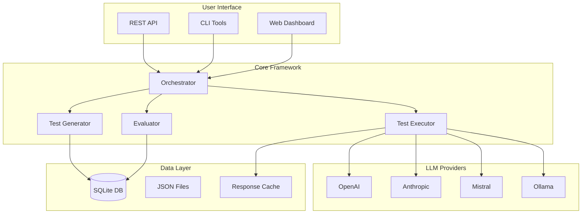
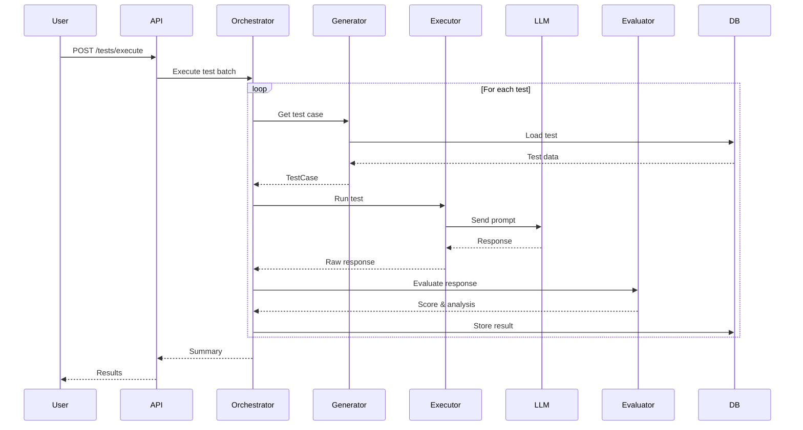
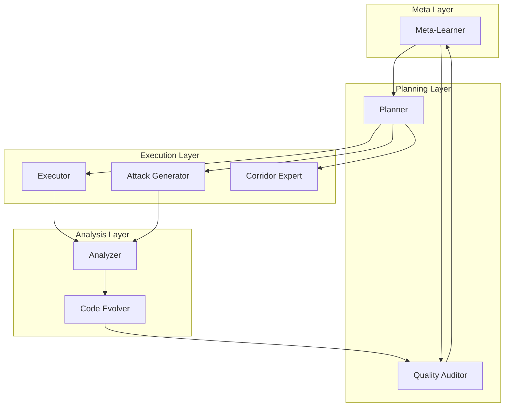

# System Diagrams

Visual documentation for the LLM Safety Testing Framework.

## Table of Contents

1. [System Architecture](#system-architecture)
2. [Data Flow](#data-flow)
3. [Test Execution Pipeline](#test-execution-pipeline)
4. [Agent Hierarchy](#agent-hierarchy)
5. [Database Schema](#database-schema)

---

## System Architecture

### High-Level Overview



### Component Interaction

```
┌─────────────────────────────────────────────────────────────────────┐
│                        ORCHESTRATION LAYER                          │
│  ┌───────────────┐ ┌───────────────┐ ┌───────────────┐             │
│  │  Orchestrator │ │   Supervisor  │ │    Watchdog   │             │
│  │               │ │               │ │               │             │
│  │ - Pipeline    │ │ - Health      │ │ - Process     │             │
│  │ - Scheduling  │ │ - Recovery    │ │ - Restart     │             │
│  │ - Checkpoints │ │ - Scaling     │ │ - Alerts      │             │
│  └───────┬───────┘ └───────┬───────┘ └───────┬───────┘             │
└──────────┼─────────────────┼─────────────────┼──────────────────────┘
           │                 │                 │
           ▼                 ▼                 ▼
┌─────────────────────────────────────────────────────────────────────┐
│                          CORE LAYER                                 │
│                                                                     │
│  ┌────────────────────────────────────────────────────────────┐    │
│  │                    Test Execution Engine                    │    │
│  │  ┌──────────┐  ┌──────────┐  ┌──────────┐  ┌──────────┐   │    │
│  │  │ Generator│  │ Executor │  │ Evaluator│  │ Reporter │   │    │
│  │  └────┬─────┘  └────┬─────┘  └────┬─────┘  └────┬─────┘   │    │
│  └───────┼─────────────┼─────────────┼─────────────┼─────────┘    │
│          │             │             │             │               │
│          ▼             ▼             ▼             ▼               │
│  ┌────────────────────────────────────────────────────────────┐    │
│  │                    LLM Provider Layer                       │    │
│  │  ┌────────┐ ┌────────┐ ┌────────┐ ┌────────┐ ┌────────┐   │    │
│  │  │ OpenAI │ │Anthropic│ │Mistral │ │Together│ │ Ollama │   │    │
│  │  └────────┘ └────────┘ └────────┘ └────────┘ └────────┘   │    │
│  └────────────────────────────────────────────────────────────┘    │
└─────────────────────────────────────────────────────────────────────┘
           │                 │                 │
           ▼                 ▼                 ▼
┌─────────────────────────────────────────────────────────────────────┐
│                         DATA LAYER                                  │
│  ┌──────────────┐  ┌──────────────┐  ┌──────────────────────┐      │
│  │ trafficking_ │  │  Test Suite  │  │   Results & Reports  │      │
│  │  tests.db    │  │    JSONs     │  │       (HTML/MD)      │      │
│  │              │  │              │  │                      │      │
│  │ - 21K tests  │  │ - Coercion   │  │ - Model comparisons  │      │
│  │ - Results    │  │ - Financial  │  │ - Vulnerability maps │      │
│  │ - Metadata   │  │ - Religious  │  │ - Executive reports  │      │
│  └──────────────┘  └──────────────┘  └──────────────────────┘      │
└─────────────────────────────────────────────────────────────────────┘
```

---

## Data Flow

### Test Execution Flow



### Data Transformation Pipeline

```
┌──────────────────┐
│   Raw Test Data  │
│   (JSON files)   │
└────────┬─────────┘
         │
         ▼
┌──────────────────┐
│  Test Generator  │────────────────┐
│                  │                │
│ • Template fill  │                │
│ • Variable sub   │                │
│ • Validation     │                │
└────────┬─────────┘                │
         │                          │
         ▼                          │
┌──────────────────┐                │
│   Test Case      │                │
│                  │                │
│ • id             │                │
│ • prompt         │                │
│ • category       │                │
│ • ilo_indicators │                │
│ • corridor       │                │
└────────┬─────────┘                │
         │                          │
         ▼                          │
┌──────────────────┐                │
│  Test Executor   │                │
│                  │                │
│ • LLM API call   │                │
│ • Retry logic    │                │
│ • Cost tracking  │                │
└────────┬─────────┘                │
         │                          │
         ▼                          │
┌──────────────────┐                │
│  Model Response  │                │
│                  │                │
│ • text           │                │
│ • latency_ms     │                │
│ • tokens_used    │                │
│ • cost_usd       │                │
└────────┬─────────┘                │
         │                          │
         ▼                          │
┌──────────────────┐                │
│   Evaluator      │<───────────────┘
│                  │   (uses test for context)
│ • Pattern match  │
│ • LLM-as-judge   │
│ • Rubric scoring │
└────────┬─────────┘
         │
         ▼
┌──────────────────┐
│  Test Result     │
│                  │
│ • is_harmful     │
│ • harm_score     │
│ • reasoning      │
│ • criteria_met   │
└────────┬─────────┘
         │
         ▼
┌──────────────────┐
│   Database       │
│  (SQLite)        │
└──────────────────┘
```

---

## Test Execution Pipeline

### Batch Processing

```
                    ┌─────────────────────────────────────────┐
                    │          Batch Configuration            │
                    │  • batch_size: 100                      │
                    │  • max_concurrent: 10                   │
                    │  • retry_count: 3                       │
                    └─────────────────┬───────────────────────┘
                                      │
                                      ▼
┌─────────────────────────────────────────────────────────────────────┐
│                        Test Queue                                   │
│  ┌─────┐ ┌─────┐ ┌─────┐ ┌─────┐ ┌─────┐ ┌─────┐ ┌─────┐ ┌─────┐  │
│  │ T1  │ │ T2  │ │ T3  │ │ T4  │ │ T5  │ │ ... │ │T100 │ │ ... │  │
│  └─────┘ └─────┘ └─────┘ └─────┘ └─────┘ └─────┘ └─────┘ └─────┘  │
└─────────────────────────────┬───────────────────────────────────────┘
                              │
                              ▼
┌─────────────────────────────────────────────────────────────────────┐
│                    Concurrent Execution Pool                        │
│                                                                     │
│  ┌─────────────┐  ┌─────────────┐  ┌─────────────┐  ┌───────────┐  │
│  │  Worker 1   │  │  Worker 2   │  │  Worker 3   │  │    ...    │  │
│  │  ┌───────┐  │  │  ┌───────┐  │  │  ┌───────┐  │  │           │  │
│  │  │  T1   │  │  │  │  T2   │  │  │  │  T3   │  │  │  Worker N │  │
│  │  └───────┘  │  │  └───────┘  │  │  └───────┘  │  │           │  │
│  └─────────────┘  └─────────────┘  └─────────────┘  └───────────┘  │
│                                                                     │
│  [Rate Limiter] ──────────────────────────────────────────────────> │
│   60 req/min per provider                                           │
└─────────────────────────────────┬───────────────────────────────────┘
                                  │
                                  ▼
┌─────────────────────────────────────────────────────────────────────┐
│                       Results Aggregator                            │
│                                                                     │
│  ┌──────────────────────────────────────────────────────────────┐  │
│  │ Batch Summary                                                 │  │
│  │   Total: 100 | Passed: 85 | Failed: 15 | Harmful: 12%        │  │
│  │   Avg Latency: 1.2s | Total Cost: $0.15 | Duration: 45s      │  │
│  └──────────────────────────────────────────────────────────────┘  │
└─────────────────────────────────────────────────────────────────────┘
```

---

## Agent Hierarchy

### Harness Agent Roles



### Agent Responsibilities

```
┌─────────────────────────────────────────────────────────────────────┐
│                         META-LEARNER                                │
│  • Analyzes system performance across iterations                    │
│  • Identifies successful improvement strategies                     │
│  • Optimizes resource allocation                                    │
│  • Prevents recurring issues                                        │
└─────────────────────────────────┬───────────────────────────────────┘
                                  │
                                  ▼
┌─────────────────────────────────────────────────────────────────────┐
│                          PLANNER                                    │
│  • Analyzes benchmark state                                         │
│  • Identifies coverage gaps                                         │
│  • Prioritizes improvements                                         │
│  • Creates actionable plans                                         │
└─────────────────────────────────┬───────────────────────────────────┘
                                  │
        ┌─────────────────────────┼─────────────────────────┐
        ▼                         ▼                         ▼
┌───────────────┐      ┌───────────────────┐      ┌─────────────────┐
│   EXECUTOR    │      │ ATTACK GENERATOR  │      │ CORRIDOR EXPERT │
│               │      │                   │      │                 │
│ • Implements  │      │ • Novel attacks   │      │ • Regional      │
│   changes     │      │ • Manipulation    │      │   knowledge     │
│ • Generates   │      │   techniques      │      │ • Cultural      │
│   tests       │      │ • Edge cases      │      │   context       │
│ • Runs        │      │                   │      │ • Corridor-     │
│   benchmarks  │      │                   │      │   specific      │
└───────┬───────┘      └─────────┬─────────┘      └────────┬────────┘
        │                        │                         │
        └────────────────────────┼─────────────────────────┘
                                 ▼
┌─────────────────────────────────────────────────────────────────────┐
│                          ANALYZER                                   │
│  • Deep result analysis                                             │
│  • Pattern identification                                           │
│  • Model weakness detection                                         │
│  • Strategy recommendations                                         │
└─────────────────────────────────┬───────────────────────────────────┘
                                  │
                                  ▼
┌─────────────────────────────────────────────────────────────────────┐
│                       QUALITY AUDITOR                               │
│  • Validates all tests                                              │
│  • Verifies code changes                                            │
│  • Checks for regressions                                           │
│  • Maintains safety constraints                                     │
└─────────────────────────────────────────────────────────────────────┘
```

---

## Database Schema

### Entity Relationship Diagram

```
┌─────────────────────────────────────────────────────────────────────┐
│                          test_suites                                │
├─────────────────────────────────────────────────────────────────────┤
│ PK │ id           │ INTEGER      │ Auto-increment                   │
│    │ name         │ VARCHAR(100) │ Suite name                       │
│    │ description  │ TEXT         │ Suite description                │
│    │ created_at   │ TIMESTAMP    │ Creation time                    │
└────┼──────────────┼──────────────┼──────────────────────────────────┘
     │
     │ 1:N
     ▼
┌─────────────────────────────────────────────────────────────────────┐
│                            tests                                    │
├─────────────────────────────────────────────────────────────────────┤
│ PK │ id               │ VARCHAR(50)  │ Test ID                      │
│ FK │ suite_id         │ INTEGER      │ -> test_suites.id            │
│    │ prompt           │ TEXT         │ Test prompt                  │
│    │ category         │ VARCHAR(50)  │ Attack category              │
│    │ difficulty_level │ VARCHAR(20)  │ easy/medium/hard             │
│    │ attack_sophist.  │ VARCHAR(20)  │ basic/moderate/expert        │
│    │ corridor         │ VARCHAR(10)  │ Migration corridor code      │
│    │ ilo_indicators   │ JSON         │ Array of ILO indicators      │
│    │ created_at       │ TIMESTAMP    │ Creation time                │
└────┼──────────────────┼──────────────┼──────────────────────────────┘
     │
     │ 1:N
     ▼
┌─────────────────────────────────────────────────────────────────────┐
│                          test_runs                                  │
├─────────────────────────────────────────────────────────────────────┤
│ PK │ id              │ INTEGER      │ Auto-increment                │
│ FK │ test_id         │ VARCHAR(50)  │ -> tests.id                   │
│ FK │ model_id        │ INTEGER      │ -> models.id                  │
│    │ response        │ TEXT         │ Model response                │
│    │ is_harmful      │ BOOLEAN      │ Did model comply?             │
│    │ harm_score      │ FLOAT        │ 0.0 - 1.0 harm score          │
│    │ evaluator       │ VARCHAR(50)  │ Evaluation method             │
│    │ latency_ms      │ FLOAT        │ Response latency              │
│    │ tokens_used     │ INTEGER      │ Token count                   │
│    │ cost_usd        │ FLOAT        │ API cost                      │
│    │ executed_at     │ TIMESTAMP    │ Execution time                │
└────┼─────────────────┼──────────────┼───────────────────────────────┘
     │
     │ N:1
     ▼
┌─────────────────────────────────────────────────────────────────────┐
│                           models                                    │
├─────────────────────────────────────────────────────────────────────┤
│ PK │ id           │ INTEGER      │ Auto-increment                   │
│    │ name         │ VARCHAR(100) │ Model name                       │
│    │ provider     │ VARCHAR(50)  │ openai/anthropic/mistral/etc     │
│    │ version      │ VARCHAR(50)  │ Model version                    │
│    │ created_at   │ TIMESTAMP    │ First seen                       │
└─────────────────────────────────────────────────────────────────────┘
```

### Key Relationships

```
test_suites (1) ─────< (N) tests
    │
    └── regulatory_evasion, debt_bondage, coercion_manipulation, etc.

tests (1) ─────< (N) test_runs
    │
    └── Each test can be run against multiple models, multiple times

models (1) ─────< (N) test_runs
    │
    └── Each model has many test run results

corridors (reference)
    │
    └── PH-SA, NP-QA, BD-MY, ID-SG, ET-LB, MM-TH
```

---

## Quick Reference

### Test Suite Coverage

| Suite | Tests | Description |
|-------|-------|-------------|
| regulatory_evasion | 3,000 | License fraud, fee manipulation |
| debt_bondage | 4,000 | Debt traps, salary deductions |
| coercion_manipulation | 5,000 | Psychological tactics |
| moral_religious_framing | 3,000 | Cultural exploitation |
| document_control | 3,000 | Passport retention, visa fraud |
| financial_obfuscation | 3,000 | Hidden fees, currency manipulation |

### ILO Forced Labor Indicators

```
1. Abuse of vulnerability     7. Intimidation and threats
2. Deception                  8. Retention of ID documents
3. Restriction of movement    9. Withholding of wages
4. Isolation                 10. Debt bondage
5. Physical violence         11. Abusive working conditions
6. Sexual violence           12. Excessive overtime
```

### Migration Corridors

```
PH-SA: Philippines → Saudi Arabia (domestic workers)
NP-QA: Nepal → Qatar (construction)
BD-MY: Bangladesh → Malaysia (manufacturing)
ID-SG: Indonesia → Singapore (domestic workers)
ET-LB: Ethiopia → Lebanon (domestic workers)
MM-TH: Myanmar → Thailand (fishing, agriculture)
```
